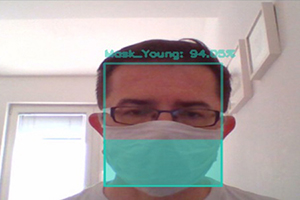

# Face-Mask-classification [](https://www.python.org/downloads/release/python-370/)
-  using (OpenCV, Keras/TensorFlow, and Deep Learning)

With the latest developments due to the covid pandemic, and the way and lifestyle that is imposed by itself and the opportunities to improve the processes is exactly one of the motivations for this project that we present below.

### Model that will recognize whether a person wear a mask on his face or not / young or old person 
- The goal of our project was to create a robust classifier, to collect data and prepare custom dataset.  
- We built a model that recognizes whether a person wear a mask on his face or not.  
- Furthermore, the model recognizes whether a person is young or old. 
_______________________________________________________________________________
| Mask Young prediction       |  No Mask Young prediction   |
:-------------------------:|:-------------------------:
  |   

## Project was divided in 3 Phases:
## Phase 1 : Dataset (avaliable for download [here](https://drive.google.com/file/d/1_Aj3mrR_t1y2gpOGhz1S_jHa6CXnP1ZL/view?usp=sharing))
- General Project Research

To train a deep learning model to classify whether a person is wearing a mask or not, we need to find a good dataset with a fair amount of images for both classes:
* wearing a mask (old and young)
* not wearing a mask (old and young)

One of the more difficult tasks we had with this project was collecting the data. We decided to collect images that we will all take without using ready-made data and datasets that was created for facial recognition purposes. We did that, that is, our database contains 80% of the real images that we as a team took.
_________________________________________________________________________________
- Dataset Collection  
This dataset consists of 2940 images belonging to four classes in four folders:

| dataset         | Young       | Old          |      
| -------------   | ------------| -------------|
| with_mask       | 775         | 685          |
| without_mask    | 756         | 724          |     

The images used were real images of faces wearing masks and faces without masks.
_____________________________________________________________________________________
- Dataset Preparation  

We expand the size of a training dataset by creating modified versions of images in the dataset 
Dataset was divided on train 80% /test 10% /valid 10% folders with python code   
with use split-folder library  
```
import split_folders
split_folders.ratio('data_final', output="output", seed=1337, ratio=(.8, .1, .1))
```

## Phase 2 : Training
- Research about neural networks  

To solve this problem, we propose a method for classification through transfer learning with several Keras models. 
| Model         | Epochs        | Test Accuracy|      
| ------------- | ------------- | -------------|
| MobileNetV2   | 50            | 91.00%
| Xception - Used Data Augumentation     | 100           | 95.97%
| DenseNet-169  | 100           | 96.98%       | 
__________________________________________________________________________________________________
### Compose neural network architectures  
Best results was achieved with DenseNet-169 model trained in ImageNet  - 100 epoch  Accuracy 96,98%  (avaliable for download [here](https://drive.google.com/file/d/1br82NTJzuguYaARf9DP5Z4tO9ai1rH5R/view?usp=sharing)) 
The experimental results show that transfer learning can achieve very good results in small dataset, and the final accuracy of face mask detection is 96,98%
| Class         | precision     | recall       | f1-score    |     
| ------------- | ------------- | -------------|------------ |
| Mask_Old      | 0.96          | 0.94         |   0.95      |
| Mask_Young    | 0.95          | 0.96         |   0.95      |
| NoMask_Old    | 0.97          | 0.99         |   0.98      |
| NoMask_Young  | 0.99          | 0.99         |   0.99      |
| micro avg     | 0.97          | 0.97         |   0.97      |
| macro avg     | 0.97          | 0.97         |   0.97      |
| weighted avg  | 0.97          | 0.97         |   0.97      |
| samples avg   | 0.97          | 0.97         |   0.97      |
___________________________________________________________________________________________________
### Fine tunning the model
The model was fine tunned with GlobalAveragePooling2D which acts like regularizer.  
___________________________________________________________________________________________________

## Phase 3 : Detection in real-time video streams

We use our model in real-time video streams as FaceMask detector 
  
-  Files contained in  "FaceMask_detect_video.zip"
