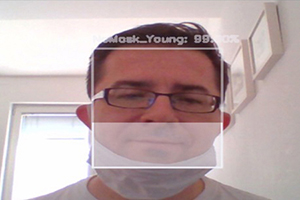

# Face-Mask-classification [](https://www.python.org/downloads/release/python-370/)
-  using (OpenCV, Keras/TensorFlow and Deep Learning)

### Model that will recognize whether a person wears a mask on his face or not / young or old person 
- The goal of our project was to create a robust classifier, to collect data and prepare custom dataset,
- We built a model that recognizes whether a person wear a mask on his face or not,
- Furthermore, the model recognizes whether a person is young or old

### :innocent: Motivation
Face masks are crucial in minimizing the spread of Covid-19 and are also compulsory in public places in many countries. The prolonged pandemic imposes new way of everyday life. Since monitoring compliance is expensive, this project can be deployed further for real-time masked/unmasked face recognition in a surveillance system to help the regulation of wearing masks in public places, such as shopping malls, supermarkets, institutions, etc.

We think that every person each individual should strive to contribute in his own way to suppress the spread of Covid-19 and putting an end to the pandemic.

Well, this is our way of contribution :smile:

### Demo
__________________________________________________________________________
| Mask Young prediction       |  No Mask Young prediction   |
:-------------------------:|:-------------------------:
  |   

## The project was divided in 3 Phases:
## :open_file_folder: Phase 1 : Data collection (dataset avaliable for download [here](https://drive.google.com/file/d/1_Aj3mrR_t1y2gpOGhz1S_jHa6CXnP1ZL/view?usp=sharing))
- General Project Research

To train a deep learning model to classify whether a person is wearing a mask or not and whether is young or old, we need to find an appropriate dataset with balanced amount of images for four classes:
* wearing a mask_old
* wearing a mask_young
* not wearing a mask_old
* not wearing a mask_young

One of the more difficult tasks we had with this project was collecting the data. We decided to collect images that we will all take without using ready-made data and datasets that were created for facial recognition purposes. We did that, that is, our database contains 80% of the real images that we as a team took. Artificial masks were not applied, so this is a real authentic dataset and we are very proud of the team effort.
_________________________________________________________________________________
- Dataset Collection  
This dataset consists of 2940 images belonging to four classes in four folders:

| dataset         | Young       | Old          | Total     |      
| -------------   | ------------| -------------|-----------|
| with_mask       | 775         | 685          | 1,460     |
| without_mask    | 756         | 724          | 1,480     |   
| Total           |1,531        |1,409         | 2,940     |

The images used were real images of faces wearing masks and faces without masks.
_____________________________________________________________________________________
- Dataset Preparation  

We expand the size of a training dataset by creating modified versions of images in the dataset. 
Dataset was divided on train 80% /test 10% /valid 10% folders with python code   
with use of split-folder library  
```
import split_folders
split_folders.ratio('data_final', output="output", seed=1337, ratio=(.8, .1, .1))
```

## :muscle: Phase 2 : Training the model
- Research about neural networks  

To solve this problem, we needed to try several image classifiers that classify one of four categories. To construct this classifier, we used pre-trained CNN.
The best results are as follows:

| Model         | Epochs        | Test Accuracy|      
| ------------- | ------------- | -------------|
| MobileNetV2   | 50            | 91.00%
| Xception - Used Data Augumentation     | 100           | 95.97%
| DenseNet-169  | 100           | 96.98%       | 
__________________________________________________________________________________________________
### :bulb: Compose neural network architectures  
Best results were achieved with DenseNet-169 model trained in ImageNet  - 100 epoch; Accuracy 96,98%  (avaliable for download [here](https://drive.google.com/file/d/1br82NTJzuguYaARf9DP5Z4tO9ai1rH5R/view?usp=sharing)) 

The experimental results show that transfer learning can achieve very good results in a small dataset, and the final accuracy of face mask detection is 96,98%.
Another, and also an important reason for choosing this model, was the fact that this model showed the best results at the very relevant metrics, recall, and precision.

#### :key: Results

| Class         | precision     | recall       | f1-score    |     
| ------------- | ------------- | -------------|------------ |
| Mask_Old      | 0.96          | 0.94         |   0.95      |
| Mask_Young    | 0.95          | 0.96         |   0.95      |
| NoMask_Old    | 0.97          | 0.99         |   0.98      |
| NoMask_Young  | 0.99          | 0.99         |   0.99      |
| micro avg     | 0.97          | 0.97         |   0.97      |
| macro avg     | 0.97          | 0.97         |   0.97      |
| weighted avg  | 0.97          | 0.97         |   0.97      |
| samples avg   | 0.97          | 0.97         |   0.97      |
___________________________________________________________________________________________________
### Fine tunning the model
The model was fine tunned with GlobalAveragePooling2D which acts like regularizer.  
___________________________________________________________________________________________________

## :rocket: Phase 3 : Detection in real-time video streams

We use our model in real-time video streams as FaceMask detector 
  
-  Files contained in  "FaceMask_detect_video.zip"

### :clap: Authors
This project is to fulfill final assignment of Brainster Data Science Academy

Team members:

* Ivan Vukelikj
* Teodora Zhivkovikj
* Angela Vasovska
* Dimitar Mihajlov
* Nikola Nastev

### :star: Extra credits

This project was supervized by [Kiril Cvetkov](https://github.com/kirilcvetkov92)
